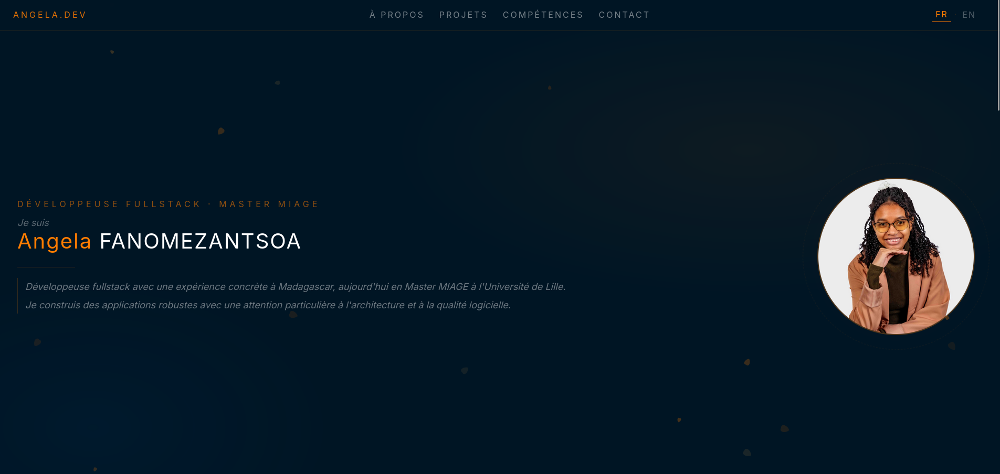

# Portfolio Project

## Description

Pour ce projet j'ai utilisé Angular. C'est un projet qui contient mes expériences professionnelles, mes formations et la présentation de mes compétences informatiques.

Voici une capture d'écran de mon portfolio pour vous donner un aperçu du projet :

Je l'ai déployé en utilisant Vercel, un outil utilisé pour déployer les projets JavaScript. En plus, il est gratuit et on peut faire du CI/CD en liant le compte Vercel avec ce repository.

## Installation

- Installer Angular si vous ne l'avez pas encore installé

  `npm install -g @angular/cli`

- Cloner le projet dans votre ordinateur

  `git clone -b porfolio_angular https://github.com/fanomezantsoa-angela/Portfolio_Angular.git porfolio_angular`

- Accéder au dossier du projet

  `cd porfolio_angular`

- Installer les dépendances

  `npm install`

- Exécuter le projet

  `ng serve`
